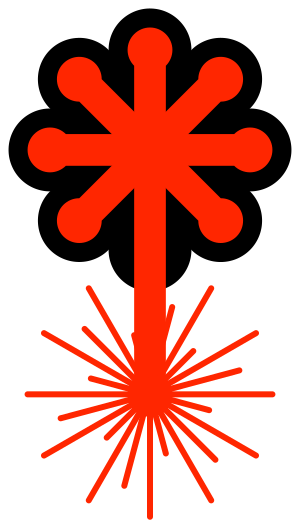

---
# Feel free to add content and custom Front Matter to this file.
# To modify the layout, see https://jekyllrb.com/docs/themes/#overriding-theme-defaults

layout: home
---
 
LaserSVG is an extension to the SVG file format to make it more suitable for the exchange of templates for laser-cutting. LaserSVG integrates two main features: marking edges as being of material width, and marking edges as being the inside or the outside of a press-fit joint.

## Namespace
To turn your SVG file into a LaserSVG file, just add the following namespace to the opening `<svg>` tag: 
	`xmlns:laser="http://www.heller-web.net/lasersvg"`

## Parameters
* laser:template="m {thickness} 0 
            l 150 0 l 0 5 l {thickness} 0 l 0 5 z"
* laser:material-thickness="none|height|width|both"
* laser:press-fit="middle|inside|outside"